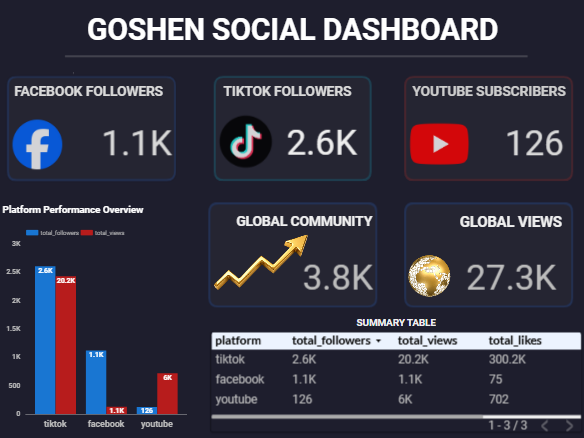
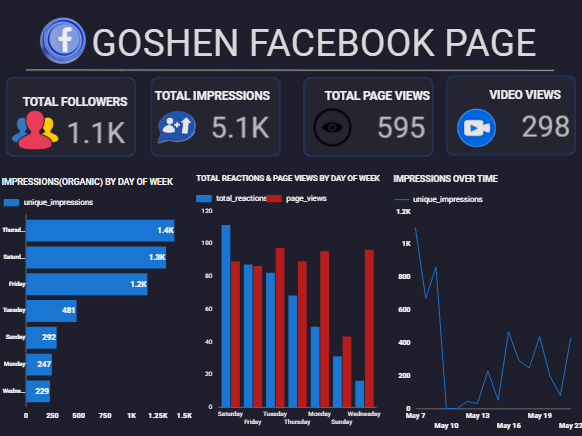
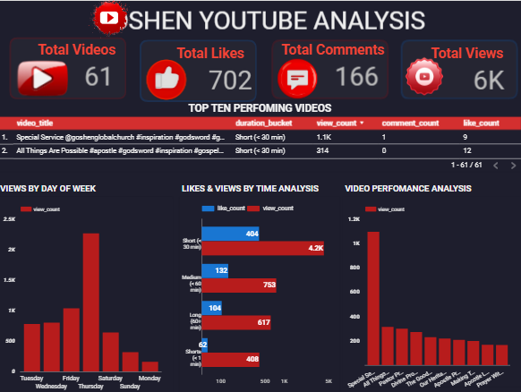
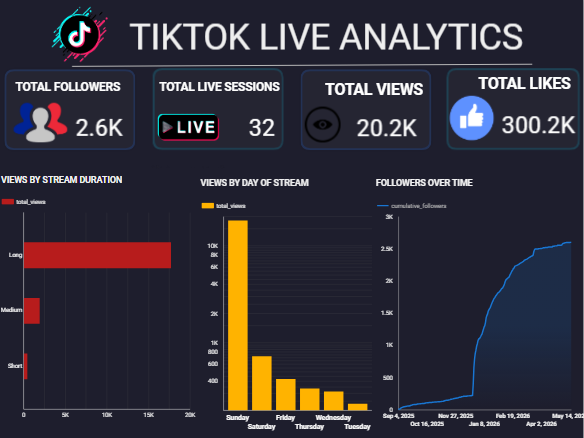
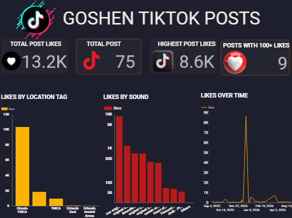

# Goshen Global Church — Analytics Platform

> *"What gets measured gets managed. What gets understood gets transformed."*

A full-stack analytics platform built for a real client — ingesting social media data from 4 sources, modelling it through a production-grade dbt pipeline, and surfacing actionable insights in a multi-page Looker Studio dashboard that drives real content decisions.

---

## 🔥 The Problem

Goshen Global Church had no idea what was working online.

They were posting content across Facebook, YouTube, and TikTok — week after week — with zero visibility into what the data was saying. No idea which platform was driving reach. No idea what day to post. No idea why one TikTok video exploded to 100K+ views while others barely moved.

Leadership was making content decisions based on gut feeling.

**I built them the infrastructure to make decisions based on data.**

---

## 🏗️ Architecture

```
┌─────────────────────────────────────────────────────────────────┐
│                        DATA SOURCES                             │
│  Facebook Graph API  │  YouTube Data API  │  TikTok CSV Export  │
└──────────────────────┴────────────────────┴─────────────────────┘
                                │
                                ▼
┌─────────────────────────────────────────────────────────────────┐
│                     INGESTION LAYER                             │
│              Python scripts → BigQuery raw tables │
│         Orchestrated via Airflow DAGs (cloud-ready)             │
│         Scheduled locally via Windows Task Scheduler            │
└─────────────────────────────────────────────────────────────────┘
                                │
                                ▼
┌─────────────────────────────────────────────────────────────────┐
│                   TRANSFORMATION LAYER                          │
│                        dbt Core                                 │
│   Staging models (views) → Mart models (tables)                 │
│   22 models │ 84 data tests │ 11 marts                          │
└─────────────────────────────────────────────────────────────────┘
                                │
                                ▼
┌─────────────────────────────────────────────────────────────────┐
│                    PRESENTATION LAYER                           │
│                  Looker Studio Dashboard                        │
│   5 pages │ Cross-platform analytics │ Actionable insights      │
└─────────────────────────────────────────────────────────────────┘
```

---

## 🛠️ Tech Stack

| Layer | Technology |
|-------|-----------|
| Data Warehouse | BigQuery (Google Cloud) |
| Transformation | dbt Core 1.11 |
| Ingestion | Python 3.11 |
| Orchestration | Apache Airflow (DAGs) + Windows Task Scheduler |
| Visualization | Looker Studio |
| Version Control | Git + GitHub |
| APIs | Facebook Graph API, YouTube Data API v3, TikTok CSV |
| Environment | Docker-ready (WSL2 architecture designed) |

---

## 📊 Dashboard Pages

🔗 [View Live Dashboard](https://datastudio.google.com/reporting/9c9bc03d-2132-49fb-adf9-55c818d2b9ab)

### 1. Goshen Social Overview


Cross-platform command centre. 3.8K total community. 27.3K total views. One glance tells the full story.

### 2. Facebook Analytics


- 1.1K followers │ 4.6K impressions │ 565 page views
- Thursday & Saturday: peak organic reach (1.3K impressions each)
- Wednesday: high page visits, zero content — **the biggest missed opportunity in the data**

### 3. YouTube Analysis


- 61 videos │ 6K views │ **23% engagement rate** — highest across all platforms
- Short content under 20 min drives 70% of all views
- Tuesday is peak viewing day — post-Sunday intentional traffic

### 4. TikTok Live Analytics


- 2.6K followers │ 20.2K views │ **300.2K likes**
- Long live streams dominate — Sunday services are the #1 content
- November 2025: viral moment — 100K+ views, 5x follower growth in 4 months

### 5. TikTok Posts Analytics


- 75 posts │ 13.2K likes │ 8.6K highest post
- Only 9 posts exceed 100 likes — channel is carried by live streams and one viral moment
- Orlando YMCA location tag → highest performing content location
- Original sound beats trending audio every time

---

## 🔍 Key Insights Surfaced

These aren't just charts. These are decisions.

**1. The Wednesday Content Desert**
Wednesday has some of the highest page view traffic of the week — people coming to check midweek service times — but near-zero reactions because there's no fresh content to engage with. One post per Wednesday would convert that passive traffic into engagement.

**2. The Thursday/Saturday Algorithm Window**
Facebook and YouTube both peak on Thursday and Saturday for organic reach. The algorithm pushes hardest on these days. Post on Thursday, post on Saturday. Everything else is downstream.

**3. The November 2025 Blueprint**
One TikTok post in November 2025 generated 100K+ views, 8K likes, and triggered 5x follower growth. It was filmed at Orlando YMCA with original sound — no music, no edits, just authentic content. That's the formula.

**4. TikTok is a Different League**
TikTok likes (300.2K) dwarf Facebook (75) and YouTube (702) combined. The church's digital ministry lives on TikTok. Everything else supports it.

**5. YouTube's Silent Strength**
126 subscribers generating 23% engagement rate. Small but deeply engaged audience. Short clips under 20 minutes drive 70% of views — the sermon archive strategy is working.

---

## 📁 Project Structure

```
goshen/
├── models/
│   ├── staging/          # 10 staging views (one per source table)
│   │   ├── stg_facebook_insights.sql
│   │   ├── stg_facebook_posts.sql
│   │   ├── stg_tiktok_followers.sql
│   │   ├── stg_tiktok_live.sql
│   │   ├── stg_tiktok_posts.sql
│   │   ├── stg_youtube_channel.sql
│   │   ├── stg_youtube_videos.sql
│   │   └── schema.yml
│   └── marts/            # 11 mart tables (business-ready)
│       ├── mart_facebook_insights.sql
│       ├── mart_facebook_metrics.sql
│       ├── mart_facebook_posts.sql
│       ├── mart_posts_performance.sql
│       ├── mart_social_followers_snapshot.sql
│       ├── mart_social_overview.sql
│       ├── mart_tiktok_activity_overlap.sql
│       ├── mart_tiktok_followers.sql
│       ├── mart_tiktok_live_performance.sql
│       ├── mart_youtube_performance.sql
│       ├── mart_youtube_videos.sql
│       └── schema.yml    # 84 data tests
├── Dags/                 # Airflow DAGs (cloud deployment ready)
│   ├── dag_master_pipeline.py
│   ├── dag_facebook_pipeline.py
│   ├── dag_youtube_pipeline.py
│   ├── dag_tiktok_pipeline.py
│   └── dag_dbt_run.py
├── ingestion/            # Python ingestion scripts
│   └── run_ingestion.py
├── run_pipeline.bat      # Local automation script
├── packages.yml          # dbt packages (dbt_utils)
└── dbt_project.yml
```

---

## ⚙️ Pipeline Automation

### Local (Active)
Pipeline runs daily via Windows Task Scheduler:
```
00:00 SAST → run_pipeline.bat triggers
           → Python ingestion scripts pull from APIs
           → dbt run rebuilds 22 models
           → dbt test validates 84 tests
           → Looker Studio reflects fresh data
```

### Cloud (Airflow DAGs — Ready for Deployment)
Full Airflow orchestration designed and documented in `/Dags`:
- **dag_master_pipeline.py** — parallel ingestion trigger + dbt orchestration
- **dag_facebook_pipeline.py** — Facebook Graph API ingestion + validation
- **dag_youtube_pipeline.py** — YouTube Data API v3 ingestion
- **dag_tiktok_pipeline.py** — TikTok CSV processing + archiving
- **dag_dbt_run.py** — Staged dbt execution (staging → marts → docs)

Deployment target: AWS EC2 or GCP Compute Engine (pending cloud budget).

---

## 🧪 Data Quality

84 dbt tests across all 11 marts:

| Test Type | Count | Purpose |
|-----------|-------|---------|
| `not_null` | 42 | Critical fields never empty |
| `unique` | 11 | Grain integrity per mart |
| `accepted_values` | 7 | Day of week validation across all models |
| `expression_is_true` | 24 | Numeric fields never negative |

**Result: PASS=82 WARN=2 ERROR=0**

The 2 warnings are documented known limitations:
- `metric_value` nulls: Meta API returns null for days with zero activity (expected)
- `total_views` nulls: Not all platforms expose views in the snapshot endpoint (expected)

---

## ⚡ Engineering Challenges

Real projects have real problems. Here's what actually happened.

---

### 1. Facebook Access Token Expiry
The Facebook Graph API uses short-lived access tokens that expire every 60 days. During development this meant the pipeline would silently fail mid-run until I caught the pattern. The fix was building token validation as the first task in the ingestion script — fail fast and loud rather than fail silently downstream. Long-lived page tokens are now used where possible, with expiry monitoring built into the pipeline health check.

### 2. Facebook API Data Limitations
The Graph API only returns data within a rolling window — not lifetime historical data. During development I was only getting 2 days of data until I understood the `since` and `until` parameter behaviour. Post-level insights are also severely restricted — the API does not return deep engagement metrics at the post level without advanced permissions. I supplemented with Facebook CSV exports where the API fell short. Full data scope is pending Meta business verification approval.

### 3. Inconsistent TikTok CSV Schemas
TikTok's weekly CSV exports don't have a guaranteed consistent schema. Column names shift, new columns appear, columns get dropped. The staging layer was built defensively — explicit column selection rather than `SELECT *`, with null coalescing on every optional field. CSVs are archived after ingestion so schema drift can be traced back to a specific export date.

### 4. Grain Mismatch Across Sources
The hardest modelling problem in the project. Facebook returns data at the page-day grain. YouTube returns data at the video grain. TikTok live returns data at the session grain. TikTok posts return data at the post grain. Joining these for cross-platform analysis required deliberate intermediate models — you can't JOIN a video to a day without an explicit aggregation step. Several early mart attempts produced fan-out duplicates before I understood the grain of each source deeply enough to model correctly.

### 5. Incremental Models vs GCP Cost Constraints
The original architecture used dbt incremental models to only process new records on each run — the correct approach for production. However BigQuery charges per byte scanned, and incremental models on BigQuery require partition filtering that added unexpected query costs during development. The pragmatic decision was to revert to full refresh models and handle deduplication in the staging layer using `ROW_NUMBER()` window functions. This trades compute cost for simplicity — an acceptable tradeoff at this data volume.

### 6. API Null Handling
Every API returns nulls differently. Facebook returns `null` for metrics with zero activity. YouTube omits fields entirely for videos with no comments. TikTok CSVs use empty strings instead of nulls. The staging layer standardises all of these — `NULLIF()` for empty strings, `COALESCE()` for missing metrics, explicit `CAST()` for type safety. Without this standardisation, every mart downstream would need its own null handling logic.

### 7. Append vs Idempotency
Early ingestion scripts used simple appends — run the script twice and you'd get duplicate rows. The fix was adding deduplication logic in staging using `ROW_NUMBER() OVER (PARTITION BY [primary_key] ORDER BY ingested_at DESC)` — always keeping the most recent record. This makes every `dbt run` idempotent — run it 10 times and the output is identical.

### 8. Date Normalisation Across Platforms
Facebook returns dates as `YYYY-MM-DD` strings. YouTube returns ISO 8601 timestamps with timezone offsets. TikTok CSVs return dates in mixed formats depending on the export region. All date handling is standardised in staging to `DATE` type in UTC, with `day_of_week`, `year_month`, and `year_week` derived fields added consistently so every mart can be sliced the same way in Looker Studio.

### 9. Balancing dbt Views vs Tables
Staging models are views — they're lightweight transformations that don't need to materialise because they're always derived from raw source tables. Mart models are tables — they're queried by Looker Studio on every dashboard load, so materialising them avoids repeated computation costs and keeps dashboard load times fast. The rule: if it's queried by an end user or BI tool, materialise it.

### 10. Looker Studio Limitations
Looker Studio doesn't support `MEDIAN()` — only `AVERAGE()`. This matters when a single viral TikTok post (8.6K likes) skews the average likes per post to 176, making it look like every post performs well when 66 of 75 posts are under 100 likes. The workaround was building a `like_bucket` field in dbt — bucketing posts by like range — so the distribution tells the honest story rather than a misleading average.

---

## 📖 Technical Deep Dive

---

### Data Modelling Philosophy

I didn't follow Kimball strictly — I followed the problem.

The guiding principle was: **staging cleans, marts answer questions.** Every staging model does one job — take a raw source table and make it trustworthy. Type casting, deduplication, null standardisation, date normalisation. No business logic. No aggregation. Just clean, typed, deduplicated data.

Every mart model does one job — answer a specific business question. `mart_facebook_insights` answers "how is the Facebook page performing day by day?" `mart_social_overview` answers "how do all platforms compare at a glance?" If I couldn't articulate the business question a mart was answering, I didn't build the mart.

The result is a model layer where any analyst can open a mart, read the name, and immediately understand what it contains and why it exists.

---

### Grain Strategy

Defining the grain was the hardest part of every mart.

The rule I settled on: **state the grain in a comment at the top of every mart model.** One row per video. One row per day per platform. One row per live session. Making this explicit forced me to think carefully before writing a single line of SQL — and caught several fan-out bugs before they reached production.

The cross-platform marts (`mart_social_overview`, `mart_social_followers_snapshot`) were the hardest. Aggregating Facebook daily data, YouTube video data, and TikTok session data to the same grain required intermediate aggregations and deliberate decisions about what "a view" means on each platform — they're not the same metric.

---

### Orchestration Design

Separate DAGs per platform was a deliberate architectural decision, not a default.

If Facebook ingestion fails — maybe the access token expired, maybe the API is rate-limited — YouTube and TikTok should still run. A single monolithic DAG would block everything on one platform's failure. Platform-level isolation means partial pipeline success is possible, and failures are immediately traceable to a specific source.

The master DAG runs all three ingestion DAGs in parallel, then triggers dbt only after all three succeed. This means dbt always runs on a complete dataset, never on partial ingestion.

---

### Testing Philosophy

84 tests sounds like a lot. The thinking was simple: **test every assumption that, if violated, would silently corrupt downstream analysis.**

Not null on primary keys — because a mart with null IDs would make deduplication impossible. Unique on grain columns — because duplicates in a mart produce double-counted metrics in Looker Studio. Accepted values on `day_of_week` — because a typo in the source data would silently drop rows from day-of-week charts. Expression is true on numeric fields — because negative view counts or follower counts would indicate ingestion corruption.

The 2 warnings are documented intentionally. `metric_value` nulls from Facebook are expected on zero-activity days — failing on them would create false alerts. `total_views` nulls in the snapshot are expected because not all platforms expose this metric — failing on them would block a pipeline run for a known limitation.

---

### Incremental Thinking

The architecture was designed for incremental models — only processing new records on each pipeline run. In practice, BigQuery's per-byte pricing made naive incremental models expensive during development without careful partition pruning.

The pragmatic decision: full refresh models with deduplication in staging. At current data volumes (tens of thousands of rows) this is fast and cheap. The incremental model code exists as commented architecture — when this moves to a cloud VM with a dedicated warehouse, switching back to incremental is a configuration change, not a rebuild.

---

### Why Certain Marts Exist

Every mart was built to answer a question leadership would actually ask.

- **`mart_executive_summary`** — "Give me one number per platform." The first thing a non-technical stakeholder opens.
- **`mart_social_overview`** — "How do all our platforms compare?" Cross-platform benchmarking in one table.
- **`mart_social_followers_snapshot`** — "Are we growing?" Follower counts need historical snapshots — a live count tells you where you are, not whether you're moving.
- **`mart_tiktok_activity_overlap`** — "Do we post more on days we also go live?" Correlation between posting behaviour and live session scheduling. Built to test the hypothesis that inconsistent posting explains inconsistent reach.
- **`mart_facebook_metrics`** — Facebook returns metrics in wide format. Unpivoting to long format makes it possible to filter, aggregate, and chart any metric without schema changes.

---

### Lessons Learned

**What broke unexpectedly:** The Facebook access token expiry was the most disruptive. A pipeline that runs perfectly for 59 days and silently fails on day 60 is harder to debug than one that fails immediately. Credential validation as the first pipeline step — not an afterthought — is now non-negotiable.

**What I'd do differently:** Add a streaming layer. The current architecture is batch — daily snapshots. For a church doing live services, near-real-time data during a Sunday stream would be significantly more valuable. Kafka or Pub/Sub feeding a streaming pipeline alongside the batch layer is the natural next evolution.

**What I'm most proud of:** The pipeline is live, running daily, and driving real decisions at Goshen Global Church. Leadership now knows to post Thursday and Saturday, to post something every Wednesday, and that TikTok live streaming is their primary growth engine. That's not a portfolio project. That's impact.

---

## 📈 Impact

This platform gave Goshen Global Church:

- **A content calendar backed by data** — not guesswork
- **Cross-platform visibility** in one dashboard
- **Identification of the Wednesday opportunity** — high traffic, zero content
- **The viral content blueprint** — Orlando YMCA + original sound = reach
- **Proof that TikTok live streaming is the primary growth engine**

> *"Goshen Global Church provided a formal recommendation letter upon project completion."*

---

## 🚀 Running Locally

```bash
# Clone the repo
git clone https://github.com/ApostolicDA/Goshen.git
cd Goshen

# Create virtual environment
python -m venv goshen-dbt-env
source goshen-dbt-env/Scripts/activate  # Windows: activate.bat

# Install dependencies
pip install dbt-bigquery dbt-utils google-cloud-bigquery python-dotenv

# Configure environment variables
cp .env.example .env
# Fill in your API keys and BigQuery credentials

# Run the pipeline
python run_ingestion.py
dbt run
dbt test
```

---

## 👤 Built By

**Proud Kudzai Ndlovu**
Data & Analytics Engineer │ Johannesburg, South Africa
Remote contracts │ UTC+2

- 📧 fanisaproud@gmail.com
- 💼 [LinkedIn](https://www.linkedin.com/in/proud-ndlovu-89070854/)
- 🐙 [GitHub](https://github.com/ApostolicDA)

*Stack: dbt  · BigQuery · Airflow · Python · SQL · Power BI · Looker Studio*

---

> Built with engineering discipline, real client data, and the conviction that every organisation — regardless of size — deserves to understand their data.
