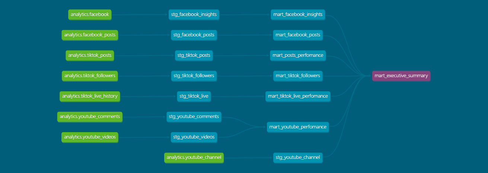
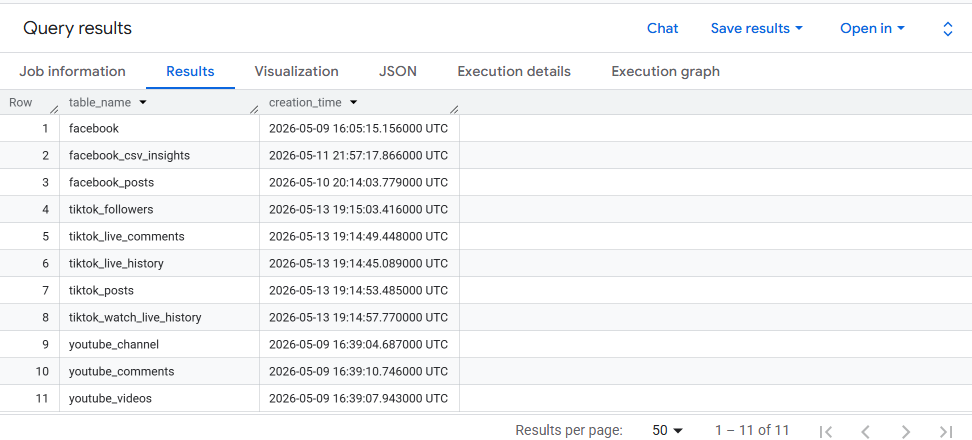
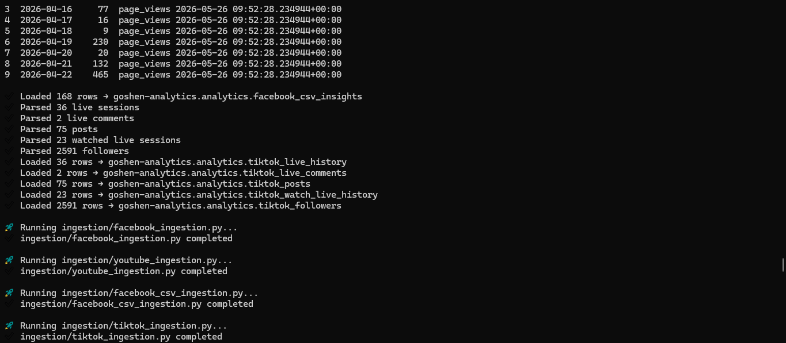
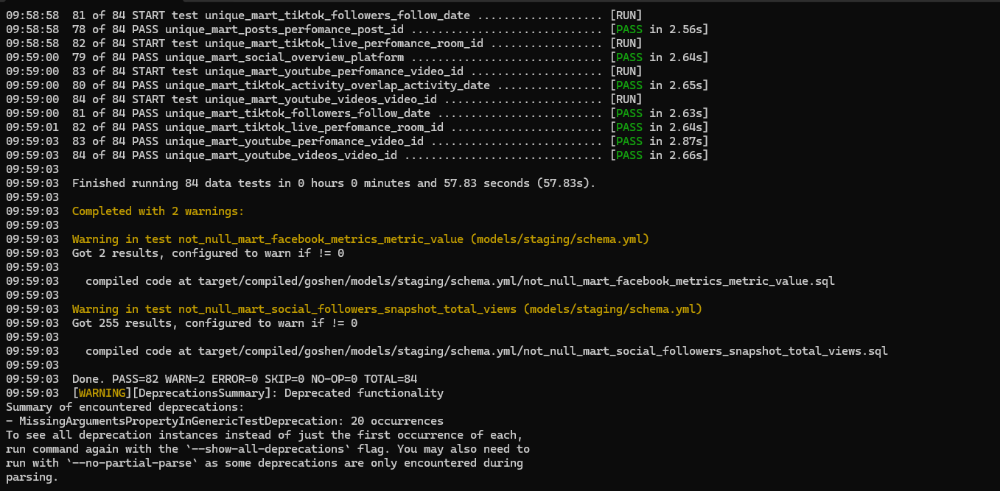

# Goshen Global Church — Analytics Platform

> *"One TikTok post. Orlando YMCA. Original sound. 100K views. We found the blueprint in the data."*

A full-stack analytics platform built for a real client — ingesting social media data from 4 sources, modelling it through a production-grade dbt pipeline, and surfacing actionable insights in a multi-page Looker Studio dashboard that drives real content decisions.

---

## 🔥 The Problem

Goshen Global Church had no idea what was working online.

They were posting content across Facebook, YouTube, and TikTok — week after week — with zero visibility into what the data was saying. No idea which platform was driving reach. No idea what day to post. No idea why one TikTok video exploded to 100K+ views while others barely moved.

Leadership was making content decisions based on gut feeling.

**I built them the infrastructure to make decisions based on data.**

---

## 🏗️ Architecture

### dbt Lineage Graph


Raw sources → Staging models → Mart models → Executive summary. Every dependency tracked, every transformation documented.

```
┌─────────────────────────────────────────────────────────────────┐
│                        DATA SOURCES                             │
│  Facebook Graph API  │  YouTube Data API  │  TikTok .txt Export │
└──────────────────────┴────────────────────┴─────────────────────┘
                                │
                                ▼
┌─────────────────────────────────────────────────────────────────┐
│                     INGESTION LAYER                             │
│              Python scripts → BigQuery raw tables               │
│         Containerised via Docker + Google Artifact Registry     │
│         Orchestrated via GCP Cloud Run Jobs                     │
│         Scheduled daily via GCP Cloud Scheduler (00:00 SAST)    │
│         Streaming layer: TikTok Live → Pub/Sub → BigQuery       │
└─────────────────────────────────────────────────────────────────┘
                                │
                                ▼
┌─────────────────────────────────────────────────────────────────┐
│                   TRANSFORMATION LAYER                          │
│                        dbt Core 1.11                            │
│   Staging models (views) → Mart models (tables)                 │
│   22 models │ 84 data tests │ 11 marts                          │
└─────────────────────────────────────────────────────────────────┘
                                │
                                ▼
┌─────────────────────────────────────────────────────────────────┐
│                    PRESENTATION LAYER                           │
│                  Looker Studio Dashboard                        │
│   5 pages │ Cross-platform analytics │ Actionable insights      │
└─────────────────────────────────────────────────────────────────┘
```

---

## 🛠️ Tech Stack

| Layer | Technology |
|-------|-----------|
| Data Warehouse | BigQuery (Google Cloud) |
| Transformation | dbt Core 1.11 |
| Ingestion | Python 3.11 |
| Containerisation | Docker + Google Artifact Registry |
| Orchestration | GCP Cloud Run Jobs + Cloud Scheduler |
| Streaming | GCP Pub/Sub (TikTok Live real-time ingestion) |
| Visualization | Looker Studio |
| Version Control | Git + GitHub |
| APIs | Facebook Graph API, YouTube Data API v3, TikTok data export |

---

## 📊 Dashboard Pages

🔗 [View Live Dashboard](https://datastudio.google.com/reporting/9c9bc03d-2132-49fb-adf9-55c818d2b9ab)

### 1. Goshen Social Overview


Cross-platform command centre. 3.8K total community. 27.3K total views. One glance tells the full story.

### 2. Facebook Analytics


- 1.1K followers │ 4.6K impressions │ 565 page views
- Thursday & Saturday: peak organic reach (1.3K impressions each)
- Wednesday: high page visits, zero content — **the biggest missed opportunity in the data**

### 3. YouTube Analysis


- 61 videos │ 6K views │ **23% engagement rate** — highest across all platforms
- Short content under 20 min drives 70% of all views
- Tuesday is peak viewing day — post-Sunday intentional traffic

### 4. TikTok Live Analytics


- 2.6K followers │ 20.2K views │ **300.2K likes**
- Long live streams dominate — Sunday services are the #1 content
- November 2025: viral moment — 100K+ views, 5x follower growth in 4 months

### 5. TikTok Posts Analytics


- 75 posts │ 13.2K likes │ 8.6K highest post
- Only 9 posts exceed 100 likes — channel is carried by live streams and one viral moment
- Orlando YMCA location tag → highest performing content location
- Original sound beats trending audio every time

---

## 🔍 Key Insights Surfaced

These aren't just charts. These are decisions.

**1. The Wednesday Content Desert**
Wednesday has some of the highest page view traffic of the week — people coming to check midweek service times — but near-zero reactions because there's no fresh content to engage with. One post per Wednesday would convert that passive traffic into engagement.

**2. The Thursday/Saturday Algorithm Window**
Facebook and YouTube both peak on Thursday and Saturday for organic reach. The algorithm pushes hardest on these days. Post on Thursday, post on Saturday. Everything else is downstream.

**3. The November 2025 Blueprint**
One TikTok post in November 2025 generated 100K+ views, 8K likes, and triggered 5x follower growth. It was filmed at Orlando YMCA with original sound — no music, no edits, just authentic content. That's the formula.

**4. TikTok is a Different League**
TikTok likes (300.2K) dwarf Facebook (75) and YouTube (702) combined. The church's digital ministry lives on TikTok. Everything else supports it.

**5. YouTube's Silent Strength**
126 subscribers generating 23% engagement rate. Small but deeply engaged audience. Short clips under 20 minutes drive 70% of views — the sermon archive strategy is working.

---

## 📁 Project Structure

```
goshen/
├── Dockerfile                # Container definition
├── docker-compose.yml        # Pipeline orchestration (ingestion → dbt run → dbt test)
├── requirements.txt          # Python + dbt dependencies
├── run_pipeline.sh           # Single command to run full pipeline (Docker)
├── run_pipeline.bat          # Legacy local automation script
├── .env.example              # Environment variable template
├── profiles.yml              # dbt BigQuery connection (env-var driven)
├── models/
│   ├── staging/              # 10 staging views (one per source table)
│   │   ├── stg_facebook_insights.sql
│   │   ├── stg_facebook_posts.sql
│   │   ├── stg_tiktok_followers.sql
│   │   ├── stg_tiktok_live.sql
│   │   ├── stg_tiktok_posts.sql
│   │   ├── stg_youtube_channel.sql
│   │   ├── stg_youtube_videos.sql
│   │   └── schema.yml
│   └── marts/                # 11 mart tables (business-ready)
│       ├── mart_facebook_insights.sql
│       ├── mart_facebook_metrics.sql
│       ├── mart_facebook_posts.sql
│       ├── mart_posts_performance.sql
│       ├── mart_social_followers_snapshot.sql
│       ├── mart_social_overview.sql
│       ├── mart_tiktok_activity_overlap.sql
│       ├── mart_tiktok_followers.sql
│       ├── mart_tiktok_live_performance.sql
│       ├── mart_youtube_performance.sql
│       ├── mart_youtube_videos.sql
│       └── schema.yml        # 84 data tests
├── Dags/                     # Airflow DAGs (cloud deployment ready)
│   ├── dag_master_pipeline.py
│   ├── dag_facebook_pipeline.py
│   ├── dag_youtube_pipeline.py
│   ├── dag_tiktok_pipeline.py
│   └── dag_dbt_run.py
├── ingestion/                # Python ingestion scripts
│   ├── facebook_ingestion.py
│   ├── facebook_csv_ingestion.py
│   ├── youtube_ingestion.py
│   └── tiktok_ingestion.py
├── streaming/                # TikTok Live real-time ingestion
│   └── tiktok_live/
│       └── listener.py       # Pub/Sub event publisher + session report
├── run_ingestion.py          # Ingestion entry point
├── packages.yml              # dbt packages (dbt_utils)
└── dbt_project.yml
```

---

## ⚙️ Pipeline Automation

### Cloud (Active — GCP Cloud Run)

Pipeline runs daily via GCP Cloud Scheduler:

```
00:00 SAST → Cloud Scheduler triggers Cloud Run Job
           → Docker container (Artifact Registry) pulls from APIs + TikTok exports
           → dbt run rebuilds 22 models in BigQuery
           → dbt test validates 84 tests
           → Looker Studio reflects fresh data
```

Containerised image stored in Google Artifact Registry (`us-central1`). Each step runs in sequence — if ingestion fails, dbt never runs.

### Streaming Layer (Active — GCP Pub/Sub)

TikTok Live sessions captured in real-time:

```
TikTok Live event → Python listener → Pub/Sub topic
                 → BigQuery raw_tiktok_live_events
                 → Auto-generated HTML session report → Email delivery
```

Captures per session: viewer counts, likes, comments, follows, shares, gifts, reconnections. Session report generated and emailed to church leadership automatically on stream end.

### Local (Legacy)

Original automation via Windows Task Scheduler + WSL2 + Docker Desktop. Replaced by cloud deployment. Local scripts retained for development use.

---

## 📸 Pipeline in Action

### BigQuery — 11 raw tables in production


### Ingestion — live data loading to BigQuery


### dbt tests — 84 tests, PASS=82 WARN=2 ERROR=0


### Cloud Run — pipeline executing in GCP


---

## 🚀 Running in the Cloud (GCP Cloud Run)

### Prerequisites
- GCP project with BigQuery, Cloud Run, Cloud Scheduler, Artifact Registry, Pub/Sub, and Secret Manager APIs enabled
- GCP service account with BigQuery, Cloud Run, and Pub/Sub permissions
- Facebook Graph API long-lived page token
- YouTube Data API v3 key

### Deploy

```bash
# Clone the repo
git clone https://github.com/ApostolicDA/Goshen.git
cd Goshen

# Build and push image to Artifact Registry
docker build -t us-central1-docker.pkg.dev/YOUR_PROJECT/goshen-pipeline/pipeline:latest .
docker push us-central1-docker.pkg.dev/YOUR_PROJECT/goshen-pipeline/pipeline:latest

# Create Cloud Run Job
gcloud run jobs create goshen-pipeline-job \
  --image=us-central1-docker.pkg.dev/YOUR_PROJECT/goshen-pipeline/pipeline:latest \
  --region=us-central1 \
  --task-timeout=3600 \
  --memory=1Gi \
  --cpu=1

# Schedule daily at midnight SAST (22:00 UTC)
gcloud scheduler jobs create http goshen-daily-pipeline \
  --location=us-central1 \
  --schedule="0 22 * * *" \
  --uri="https://us-central1-run.googleapis.com/apis/run.googleapis.com/v1/namespaces/YOUR_PROJECT/jobs/goshen-pipeline-job:run" \
  --oauth-service-account-email=YOUR_SERVICE_ACCOUNT@YOUR_PROJECT.iam.gserviceaccount.com

# Trigger manually
gcloud run jobs execute goshen-pipeline-job --region=us-central1
```

### Key Environment Variables

| Variable | Description |
|---|---|
| `GOOGLE_APPLICATION_CREDENTIALS` | Path to GCP service account JSON |
| `GCP_PROJECT_ID` | BigQuery project ID |
| `BQ_DATASET` | BigQuery dataset name |
| `FACEBOOK_ACCESS_TOKEN` | Facebook Graph API long-lived page token |
| `YOUTUBE_API_KEY` | YouTube Data API v3 key |
| `PUBSUB_TOPIC` | GCP Pub/Sub topic for TikTok Live events |

---

## 🧪 Data Quality

84 dbt tests across all 11 marts:

| Test Type | Count | Purpose |
|-----------|-------|---------|
| `not_null` | 42 | Critical fields never empty |
| `unique` | 11 | Grain integrity per mart |
| `accepted_values` | 7 | Day of week validation across all models |
| `expression_is_true` | 24 | Numeric fields never negative |

**Result: PASS=82 WARN=2 ERROR=0**

The 2 warnings are documented known limitations:
- `metric_value` nulls: Meta API returns null for days with zero activity (expected)
- `total_views` nulls: Not all platforms expose views in the snapshot endpoint (expected)

---

## ⚡ Engineering Challenges

Real projects have real problems. Here's what actually happened.

### 1. Dockerising the Pipeline
The original pipeline ran via `run_pipeline.bat` with hardcoded Windows paths throughout the ingestion scripts (`C:\Users\...`). Containerising required removing every hardcoded path, replacing them with environment variables, and mounting host directories as Docker volumes. The `profiles.yml` needed to work in both local and container contexts — solved using dbt's `env_var()` function so the same file works everywhere, with the credential path injected at runtime.

### 2. Migrating from Local to GCP Cloud Run
The local pipeline ran via WSL2 + Windows Task Scheduler. Migrating to Cloud Run required pushing the Docker image to Google Artifact Registry, configuring Secret Manager for credentials, and wiring Cloud Scheduler to trigger the job daily. The same Docker image runs in both environments — no code changes, only infrastructure changes.

### 3. Facebook Access Token Expiry
The Facebook Graph API uses short-lived access tokens that expire every 60 days. During development this meant the pipeline would silently fail mid-run until I caught the pattern. The fix was building token validation as the first task in the ingestion script — fail fast and loud rather than fail silently downstream. Long-lived page tokens are now used where possible.

### 4. Facebook API Data Limitations
The Graph API only returns data within a rolling window — not lifetime historical data. Post-level insights are also severely restricted without advanced permissions. I supplemented with Facebook CSV exports where the API fell short. Full data scope is pending Meta business verification approval.

### 5. TikTok Data Format
TikTok doesn't provide a standard API for historical data — exports come as structured `.txt` files with custom delimiters. Built a custom regex parser to extract sessions, metrics, and timestamps from raw text across five export types (live history, posts, followers, comments, watch history).

### 6. Building the Streaming Layer
Batch data tells you what happened yesterday. For a church doing Sunday live streams, that's not enough. Built a real-time TikTok Live listener using `TikTokLive` + GCP Pub/Sub — capturing viewer counts, likes, comments, follows, shares, and gifts as events stream in. On stream end, the session data is aggregated, an HTML report is generated, and it's emailed automatically to church leadership.

### 7. Grain Mismatch Across Sources
The hardest modelling problem in the project. Facebook returns data at the page-day grain. YouTube returns data at the video grain. TikTok live returns data at the session grain. TikTok posts return data at the post grain. Joining these for cross-platform analysis required deliberate intermediate models — you can't JOIN a video to a day without an explicit aggregation step. Several early mart attempts produced fan-out duplicates before I understood the grain of each source deeply enough to model correctly.

### 8. Incremental Models vs GCP Cost Constraints
The original architecture used dbt incremental models to only process new records on each run — the correct approach for production. However BigQuery charges per byte scanned, and incremental models require partition filtering that added unexpected query costs during development. The pragmatic decision was to revert to full refresh models and handle deduplication in the staging layer using `ROW_NUMBER()` window functions.

### 9. API Null Handling
Every API returns nulls differently. Facebook returns `null` for metrics with zero activity. YouTube omits fields entirely for videos with no comments. TikTok exports use empty strings instead of nulls. The staging layer standardises all of these — `NULLIF()` for empty strings, `COALESCE()` for missing metrics, explicit `CAST()` for type safety.

### 10. Append vs Idempotency
Early ingestion scripts used simple appends — run the script twice and you'd get duplicate rows. The fix was adding deduplication logic in staging using `ROW_NUMBER() OVER (PARTITION BY [primary_key] ORDER BY ingested_at DESC)` — always keeping the most recent record. This makes every `dbt run` idempotent — run it 10 times and the output is identical.

### 11. Date Normalisation Across Platforms
Facebook returns dates as `YYYY-MM-DD` strings. YouTube returns ISO 8601 timestamps with timezone offsets. TikTok exports return dates with UTC suffixes. All date handling is standardised in staging to `DATE` type in UTC, with `day_of_week`, `year_month`, and `year_week` derived fields added consistently so every mart can be sliced the same way in Looker Studio.

### 12. Looker Studio Limitations
Looker Studio doesn't support `MEDIAN()` — only `AVERAGE()`. This matters when a single viral TikTok post (8.6K likes) skews the average likes per post to 176, making it look like every post performs well when 66 of 75 posts are under 100 likes. The workaround was building a `like_bucket` field in dbt — bucketing posts by like range — so the distribution tells the honest story rather than a misleading average.

---

## 📖 Technical Deep Dive

### Data Modelling Philosophy

I didn't follow Kimball strictly — I followed the problem.

The guiding principle was: **staging cleans, marts answer questions.** Every staging model does one job — take a raw source table and make it trustworthy. Type casting, deduplication, null standardisation, date normalisation. No business logic. No aggregation. Just clean, typed, deduplicated data.

Every mart model does one job — answer a specific business question. If I couldn't articulate the business question a mart was answering, I didn't build the mart.

### Grain Strategy

The rule I settled on: **state the grain in a comment at the top of every mart model.** One row per video. One row per day per platform. One row per live session. Making this explicit forced me to think carefully before writing a single line of SQL — and caught several fan-out bugs before they reached production.

### Orchestration Design

Separate DAGs per platform was a deliberate architectural decision. If Facebook ingestion fails, YouTube and TikTok should still run. Platform-level isolation means partial pipeline success is possible, and failures are immediately traceable to a specific source.

### Testing Philosophy

84 tests sounds like a lot. The thinking was simple: **test every assumption that, if violated, would silently corrupt downstream analysis.**

### Why Certain Marts Exist

- **`mart_executive_summary`** — "Give me one number per platform."
- **`mart_social_overview`** — "How do all our platforms compare?"
- **`mart_social_followers_snapshot`** — "Are we growing?"
- **`mart_tiktok_activity_overlap`** — "Do we post more on days we also go live?"
- **`mart_facebook_metrics`** — Facebook metrics unpivoted from wide to long format.

### Lessons Learned

**What broke unexpectedly:** Hardcoded paths. A pipeline that works perfectly on one machine and silently fails in a container is worse than one that fails loudly. Every path is now an environment variable. Every credential is mounted, never embedded.

**What I added after v1:** A real-time streaming layer. Pub/Sub now captures TikTok Live sessions as they happen — viewer counts, likes, comments, gifts — with an auto-generated HTML report emailed to church leadership on stream end. Batch tells you what happened yesterday. Streaming tells you what's happening now.

**What I'm most proud of:** The pipeline is live, containerised, deployed to GCP Cloud Run, and running daily without touching a local machine. Leadership now knows to post Thursday and Saturday, to post something every Wednesday, and that TikTok live streaming is their primary growth engine. That's not a portfolio project. That's impact.

---

## 📈 Impact

This platform gave Goshen Global Church:

- **A content calendar backed by data** — not guesswork
- **Cross-platform visibility** in one dashboard
- **Identification of the Wednesday opportunity** — high traffic, zero content
- **The viral content blueprint** — Orlando YMCA + original sound = reach
- **Proof that TikTok live streaming is the primary growth engine**
- **Real-time session reports** delivered to leadership after every Sunday livestream

> *Live in production. Running on GCP. Driving real content decisions at Goshen Global Church.*

---

## 👤 Built By

**Proud Kudzai Ndlovu**
Data & Analytics Engineer │ Johannesburg, South Africa
Remote contracts │ UTC+2

- 📧 fanisaproud@gmail.com
- 💼 [LinkedIn](https://www.linkedin.com/in/proud-ndlovu-89070854/)
- 🐙 [GitHub](https://github.com/ApostolicDA)

*Stack: dbt · BigQuery · Docker · GCP Cloud Run · Pub/Sub · Python · SQL · Looker Studio*

---

> Built with engineering discipline, real client data, and the conviction that every organisation — regardless of size — deserves to understand their data.
